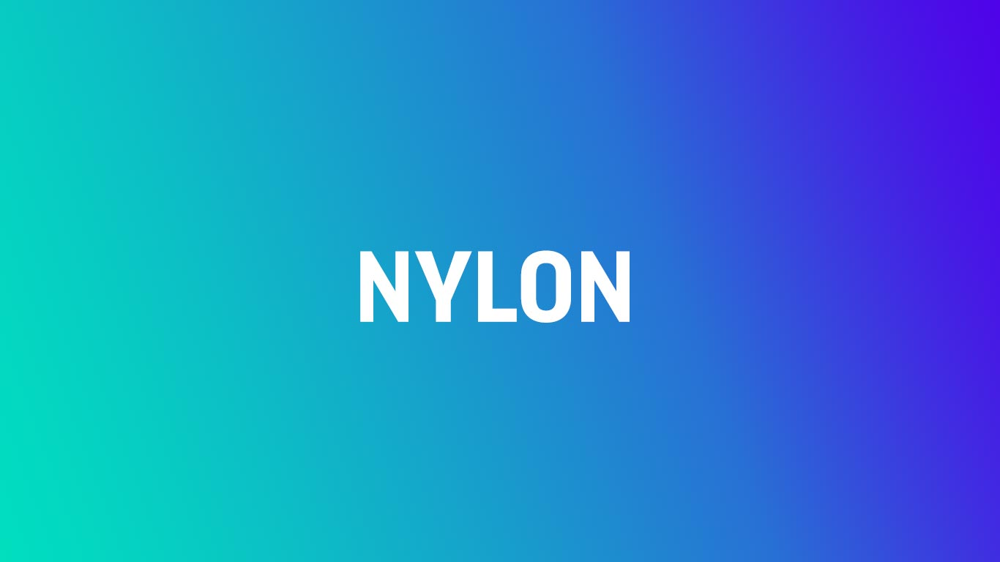
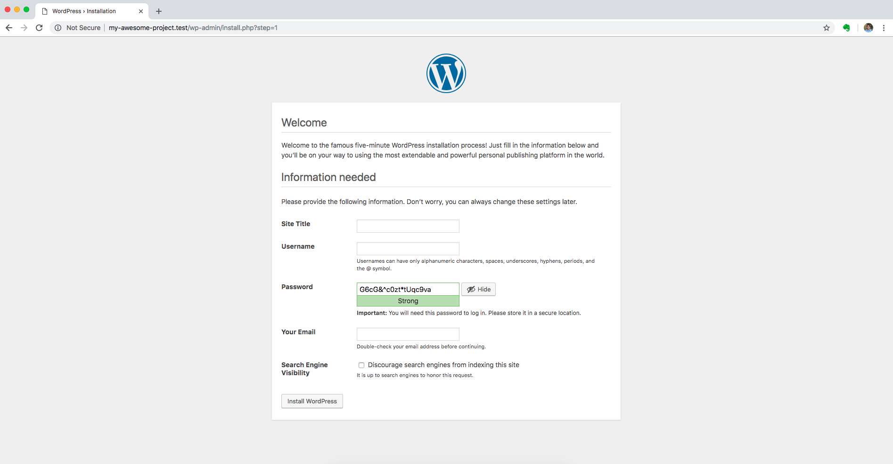
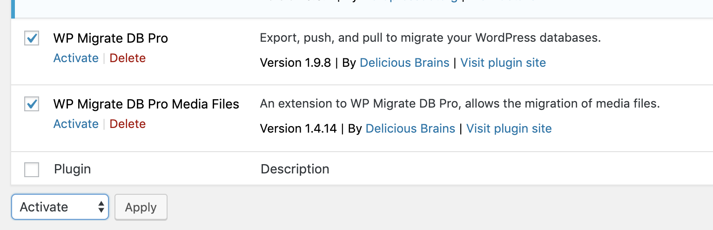
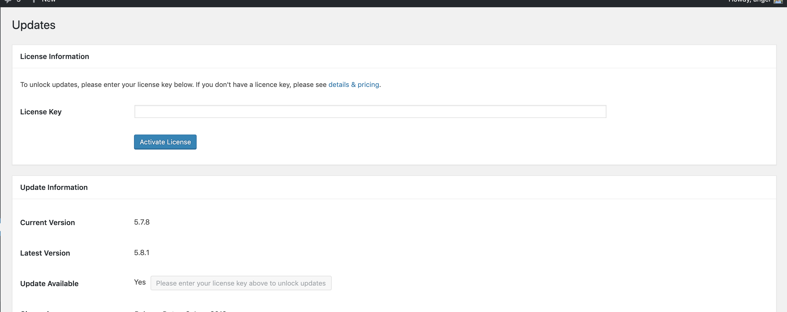
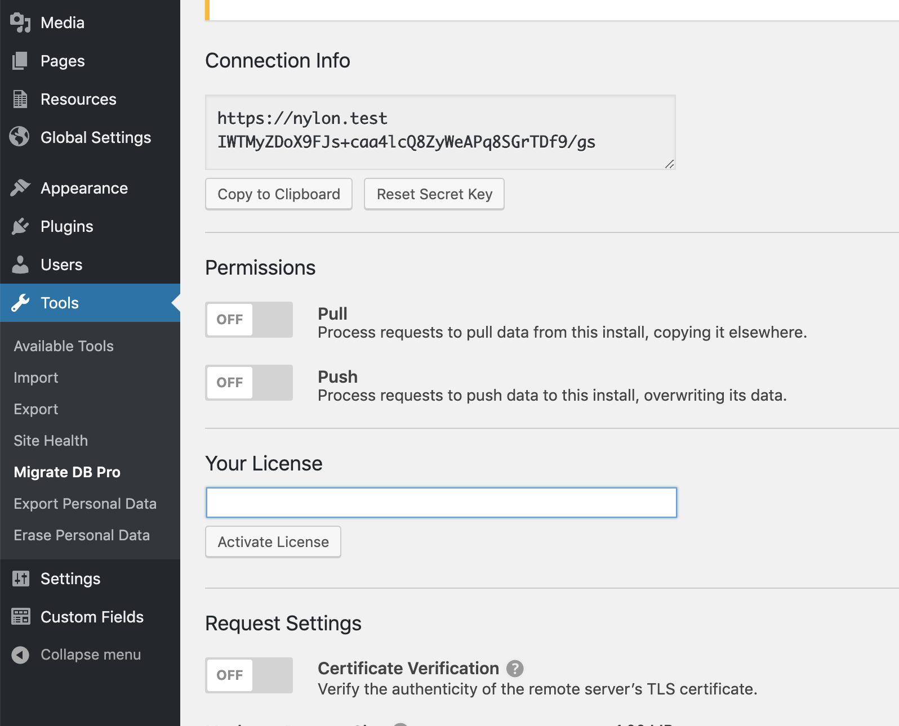
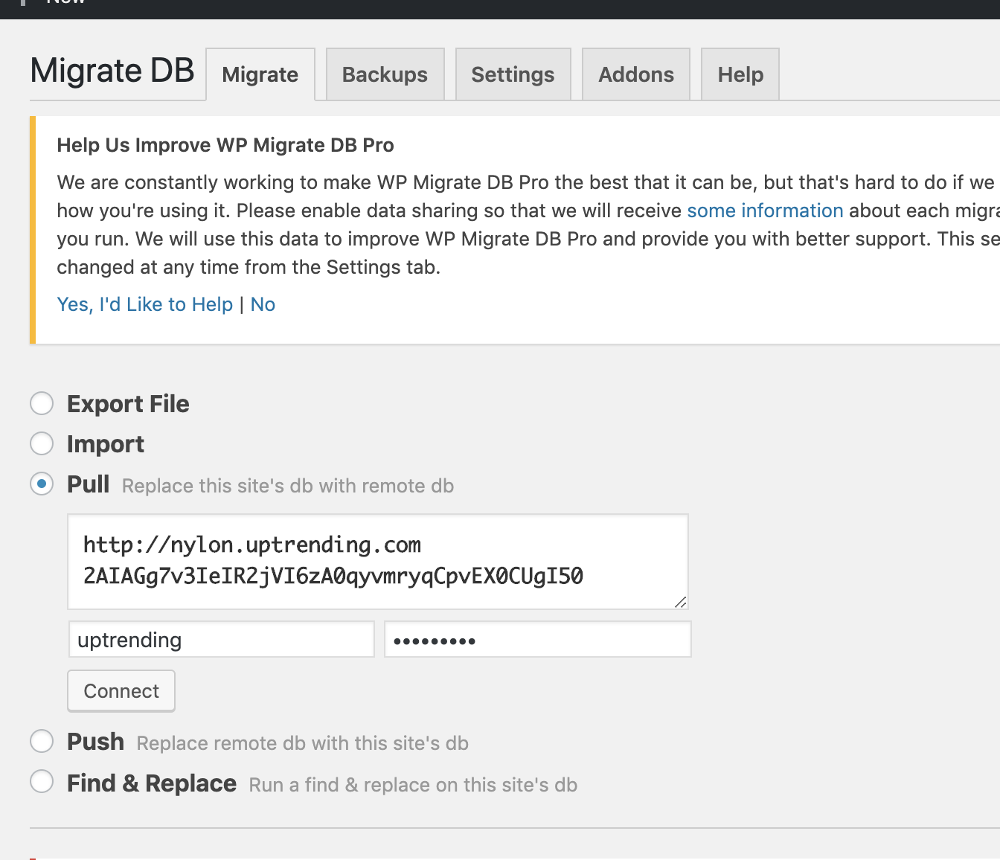
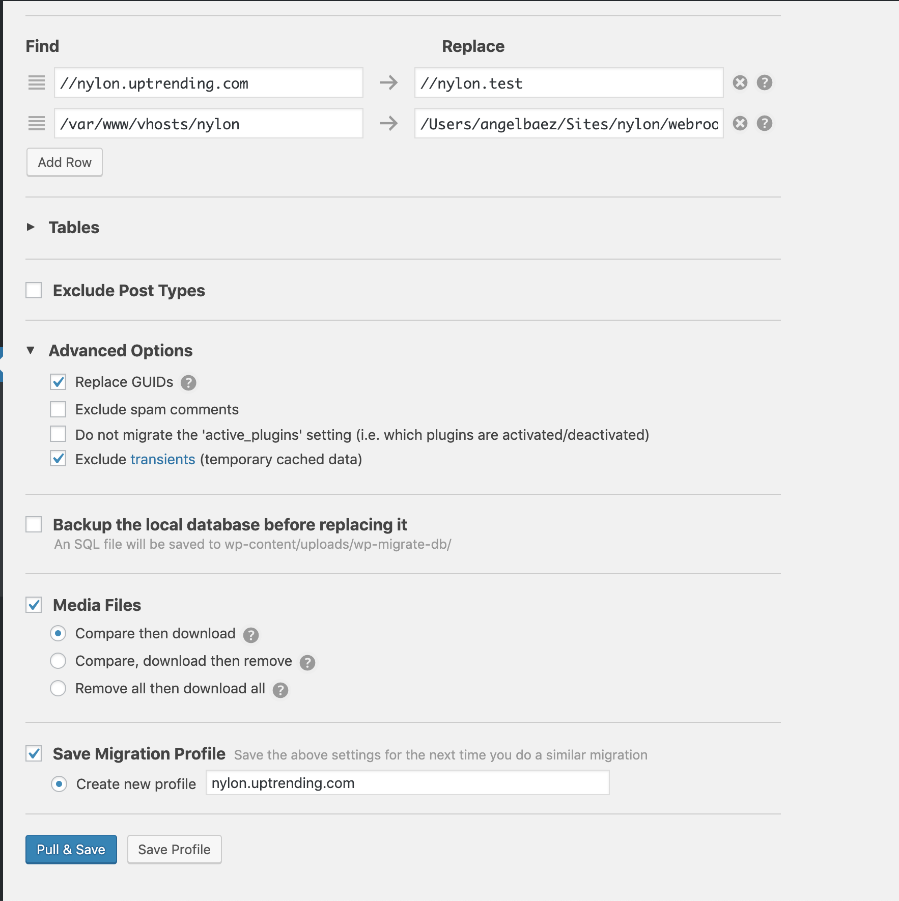
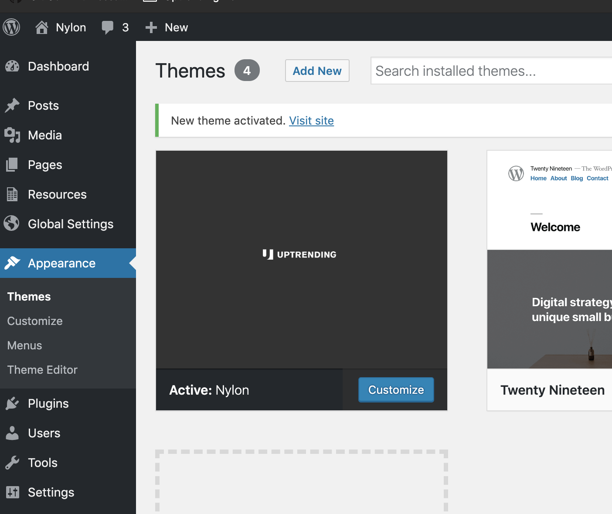

# What is Nylon
Nylon is our internal WordPress starter template to getting started your project

  

## Getting Started

### Requirements
- A web server running on your machine Apache/Nginx.
- Node.js
- wp-cli

If you're using macOS system we recommend you to use [laravel/valet](https://laravel.com/docs/5.7/valet), it configures your mac to have a ready-to-go dev environment.


### Installing Nylon

1. First of all, clone the repository:

```bash
git clone git@github.com:UpTrendingLLC/Nylon.git my-awesome-project 
```

2. Copy the .env example file and paste it in the root folder location. 

```bash
cd my-awesome-project
cp local-config-sample.php local-config.php

```

3. Install Wordpress into the *webroot* folder. You can use the wp CLI or just download the latest release of WordPress which can be found at [Wordpress.org](https://wordpress.org).

```bash
cd webroot
wp core download
```

If you're using Valet enter to webroot folder and create a link with the domain you want to use on your local setup. 
```bash

cd webroot && valet link [domain.test]

```

4. Copy the *local-config-sample.php* file as *local-config.php* in the same location. Once copied, write your own settings for your local environment:

```php
// Database info & Global variables
define( 'DB_NAME', 'local_db_name' );
define( 'DB_USER', 'local_db_user' );
define( 'DB_PASSWORD', 'local_db_password' );
define( 'DB_HOST', 'localhost' ); // Probably 'localhost'
define( 'WP_ENVIRONMENT', 'LOCAL');

```

5. Wordpress Setup

Now enter to your project on the domain yoy specified and finish the setup:


After the installation you need to activate three plugins to fetch the staging database to your local database. Go to Plugins and select the following libraries:
- WP Migrate DB Pro
- WP Migrate DB Pro Media Files
- Advanced Custom Fields PRO



Then, you need to enter the license key for the ACF plugin. Go to Custom Fields -> Updates, and update the key:



Also you will need to enter the license for WP Migrate DB. Go to Tools -> Migrate DB Pro -> Settings and enter the license, **and turn on the permissions to pull**.



if you enter in the middle of the project and there's already work done you need to puull the database from staging. You can skip this step if you're starting a new project from zero. Go to Tools -> Migrate DB Pro and select the option **Pull** and enter your project's connection info without https, you can get this info on the staging or production project's site.

If you're pulling the DB from staging, you have to enter the basic auth



Once you entered the connection info, pull the DB, the media files and save your migration profile




The last step is activate Nylon's theme. Go the Appearance -> Themes and click the "activate" button




6. Theming Setup
Install the dependencies and run the following command:

```bash
// Move to the root folder:
npm i 
npm run watch
```
This will launch a new window browser pointing to [http://localhost:3000](http://localhost:3000). If everything is correct you should see a successful message. 

If something goes wrong during the installation, please go to the troubleshooting documentation, you can found it on [docs/troubleshooting](docs/troubleshooting.md).